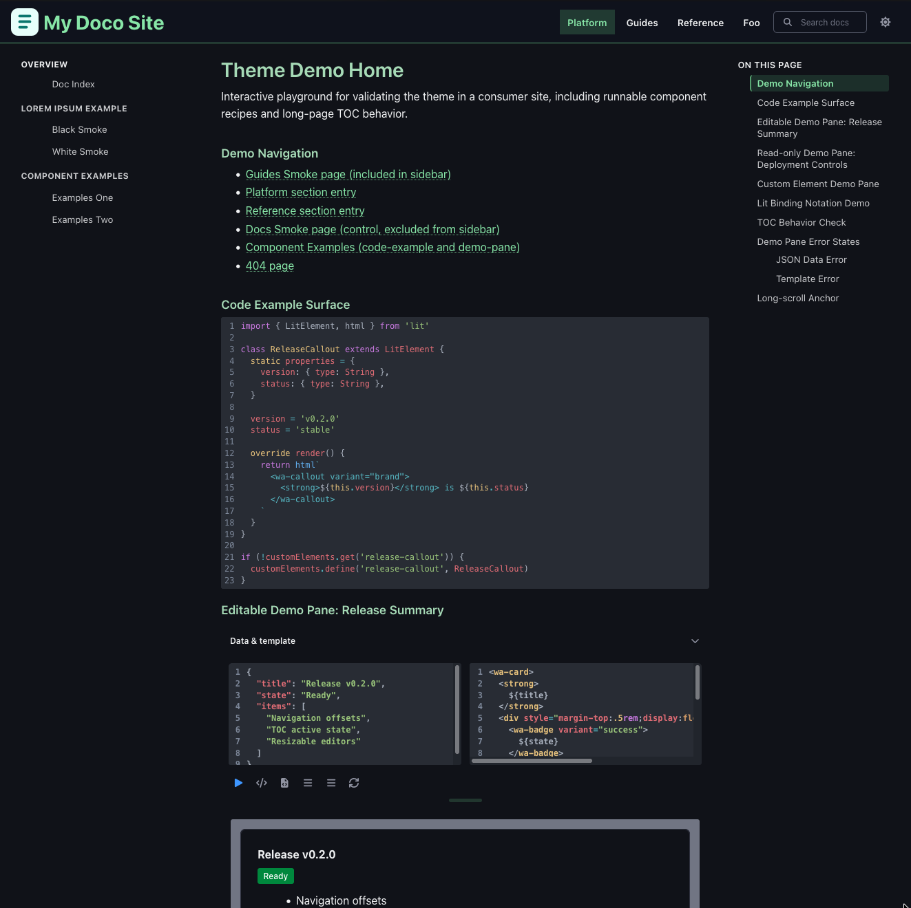

# Theme WebAwesome (Lume)



A Lume theme for technical documentation built with WebAwesome + Lit web components.

## First-time setup

Use this as your minimal config (matches the root [`_config.ts`](./_config.ts)):

```ts
import lume from 'lume/mod.ts'
import theme from './mod.ts'

const site = lume({ src: './src' })

site.use(theme({
  siteToc: {
    root: '.',
  },
  webawesome: {},
}))

export default site
```

Then run:

```sh
deno task serve
```

## Example with common customization

The integration test site uses this config (from [`test/_config.ts`](./test/_config.ts)):

```ts
import lume from 'lume/mod.ts'
import theme from 'theme/mod.ts'

const site = lume()

site.copy('logos')

site.use(theme({
  siteLogo: {
    src: '/logos/test-site-logo.svg',
    alt: 'Theme test site logo',
  },
  siteToc: {
    root: '.',
    sections: [
      { folder: 'docs', label: 'Platform', order: 0 },
      { folder: 'guides', label: 'Guides', order: 1 },
      { folder: 'reference', label: 'Reference', order: 2 },
      { folder: 'platform', label: 'Foo', order: 3 },
    ],
  },
  webawesome: {
    customPropertiesCssPath: '/styles/webawesome-theme.css',
  },
}))

export default site
```

## What the theme configures for you

From [`plugins.ts`](./plugins.ts), `theme()` wires up:

- Plugin stack: `lightningcss`, `base_path`, `nav`, `search`, `pagefind`, `metas`, markdown `toc`, `sitemap`, `favicon`,
  `esbuild`.
- Free WebAwesome asset copy in build output (default `assetBasePath: /lib/webawesome/dist-cdn`).
- `style.css` and your component entrypoint bundle.
- HTML heading preprocessing (`h2`-`h6`) that adds stable `id`s and page-level TOC data.
- Theme navigation data (`themeNavigation`) based on `siteToc` sections.
- Theme data objects:
  - `webawesome` (resolved asset paths and mode),
  - `themeComponents` (entrypoints and script output),
  - `themeBranding` (logo),
  - `themeNavigation` (resolved nav snapshot).
- Optional local CSS token file add (`webawesome.customPropertiesCssPath`).

## Main options

`theme(options)` supports:

- `webawesome`
  - `mode`: `'free' | 'pro'` (default: `'free'`)
  - `assetBasePath`, `cssPath`, `loaderPath`, `splitPanelPath`
  - `customPropertiesCssPath`
- `siteToc`
  - `root` (required by interface, defaults to `'.'`)
  - `sections` (`[{ folder, label, order }]`)
  - `includeUrlPrefix` (default: `'/'`)
  - `filter` (advanced nav filter string override)
- `siteLogo`
  - `src` and optional `alt`
- `componentEntrypoint`
  - default: `'components/index.ts'`
- `additionalComponentEntrypoints`
  - default: `[]`
- `favicon`, `sitemap`
  - passed through to Lume plugins

## WebAwesome free vs pro

- `mode: 'free'` (default): theme copies `npm:@awesome.me/webawesome@^3.1.0/dist-cdn/**` into your output.
- `mode: 'pro'`: provide your Pro asset paths via `assetBasePath`/`cssPath`/`loaderPath`/`splitPanelPath`.

## Using your own Lit components

Point `componentEntrypoint` to a module that imports and registers your elements:

```ts
site.use(theme({
  componentEntrypoint: 'components/custom-entry.ts',
  additionalComponentEntrypoints: ['components/analytics.ts'],
}))
```

Always guard custom element registration:

```ts
if (!customElements.get('my-card')) {
  customElements.define('my-card', MyCard)
}
```

## Built-in docs components

### `<demo-pane>`

Interactive runnable example surface that combines:

- JSON data input,
- HTML template input with `${...}` expressions,
- live rendered output.

Key features:

- editable and read-only modes,
- run / format / reset actions,
- optional fit-to-content preview sizing,
- auto-loading of `wa-*` components used in the template (plus explicit `imports` support),
- Lit-style template bindings such as `.prop`, `?attr`, and `@event`.

Attributes:

- `data` (string, default `'{}'`): JSON object string used as template scope.
- `template` (string, default `''`): HTML template source.
- `imports` (string, default `'[]'`): JSON array of WebAwesome component names (for example `["button","badge"]`).
- `editable` (boolean, default `true`): set `editable="false"` for non-editable display mode.
- `readonly` (boolean, default `false`): disables editing/actions even if `editable` is true.
- `layout` (`horizontal | tabs`, default `horizontal`): non-editable layout mode.
- `default-tab` (`data | markup | output`, default `output`): initial active tab.
- `editor-open` (boolean, default `false`): opens editor panel on load.
- `data-label` / `template-label` (string): custom labels for editor panes.
- `output-background` (string): CSS background value for the output area.
- `fit-content` (boolean, default `false`): auto-size preview height to rendered output.

Basic usage:

```html
<demo-pane
  data='{"label":"Deploy","variant":"brand"}'
  template='<wa-button variant="${variant}">${label}</wa-button>'
  imports='["button"]'
  default-tab="output"
  editor-open
></demo-pane>
```

Read-only preview:

```html
<demo-pane
  data='{"label":"Deploy","variant":"brand"}'
  template='<wa-button variant="${variant}">${label}</wa-button>'
  editable="false"
  fit-content
></demo-pane>
```

### `<code-example>`

Read-only code snippet renderer using CodeMirror, intended for docs snippets.

Key features:

- theme-consistent syntax highlighting,
- indentation normalization for slotted multiline content,
- optional language inference from slotted content (`data-language`, `language-*` class, or HTML element content).

Attributes:

- `code` (string, default empty): explicit snippet text.
- `language` (`json | html | javascript | typescript | text`, default inferred or `text`).
- `line-numbers` (boolean, default `true`).

Basic usage (slotted code):

```html
<code-example language="typescript">
  console.log('Hello docs')
</code-example>
```

Basic usage (explicit `code` value):

```html
<code-example
  language="json"
  code='{"name":"theme-webawesome","mode":"free"}'
></code-example>
```

## Development commands

Theme repo root:

```sh
deno task serve
deno task build
deno lint
deno task test:browser
```

Integration test site:

```sh
cd test
deno task serve
deno task build
```
